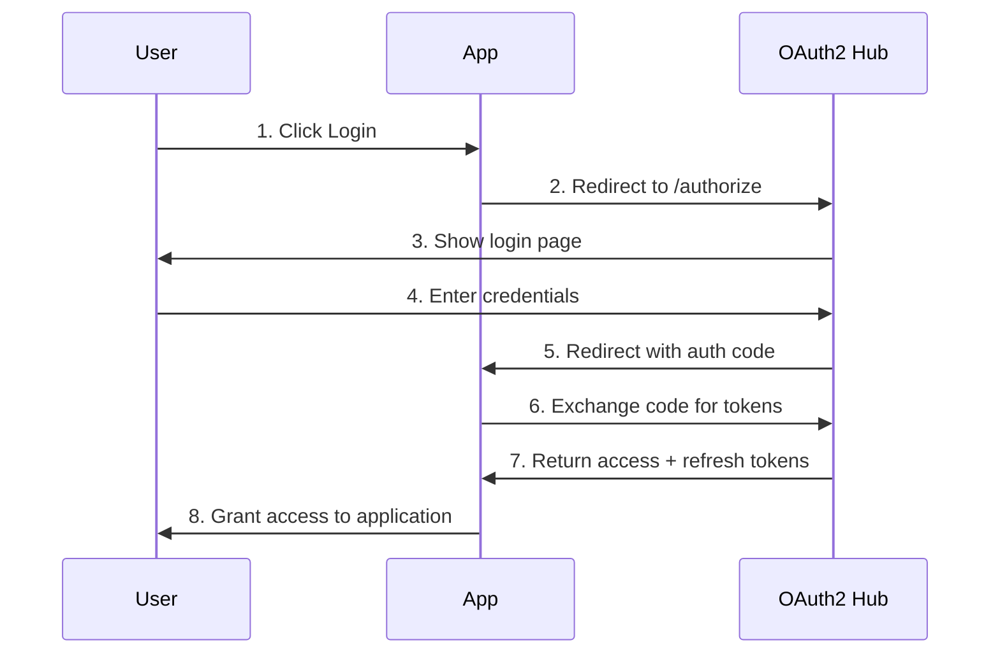

# ZipCode OAuth2 Hub - Client Integration Guide

Complete guide for integrating your educational applications with the ZipCode OAuth2 Hub authentication and authorization system.

## 📖 Table of Contents

- [Quick Start Checklist](#quick-start-checklist)
- [Prerequisites](#prerequisites)
- [Understanding OAuth2 Flows](#understanding-oauth2-flows)
- [Client Registration](#client-registration)
- [Authentication Flows](#authentication-flows)
- [Token Management](#token-management)
- [Educational Policies](#educational-policies)
- [Platform-Specific Examples](#platform-specific-examples)
- [Security Best Practices](#security-best-practices)
- [Troubleshooting](#troubleshooting)
- [Production Deployment](#production-deployment)
- [Quick Reference](#quick-reference)

---

## Quick Start Checklist

✅ **Before You Begin:**
- [ ] ZipCode OAuth2 Hub is running and accessible
- [ ] You have admin access to register your application
- [ ] You understand your application type (web app, SPA, mobile, service)
- [ ] You have chosen the appropriate OAuth2 flow for your needs

✅ **Integration Steps:**
- [ ] Register your application as an OAuth2 client
- [ ] Implement the authentication flow
- [ ] Handle tokens securely  
- [ ] Test the integration
- [ ] Implement educational policy handling
- [ ] Deploy to production

**Estimated Time:** 2-4 hours for basic integration

---

## Prerequisites

### System Requirements
- ZipCode OAuth2 Hub running and accessible
- Your application can make HTTP requests
- Ability to handle redirects (for web applications)
- Secure storage capability for tokens

### Knowledge Requirements
- Basic understanding of OAuth 2.0 concepts
- HTTP/REST API experience
- JWT token handling
- Your platform's HTTP client library

### Educational Context
The ZipCode OAuth2 Hub includes educational-specific features:
- **Cohort-based access control** - Users only access their cohort's resources
- **Time-based policies** - Exams and labs have specific time windows
- **Role-based permissions** - Different access levels for students, instructors, and admins
- **Submission tracking** - Assignment deadlines and attempt limits

---

## Understanding OAuth2 Flows

### Flow Selection Guide

| Application Type | Recommended Flow | PKCE Required | Client Secret |
|------------------|------------------|---------------|---------------|
| **Web App (Server-Side)** | Authorization Code | No | Yes |
| **SPA (Single Page App)** | Authorization Code + PKCE | Yes | No |
| **Mobile App** | Authorization Code + PKCE | Yes | No |
| **Service/API** | Client Credentials | No | Yes |

### Authorization Code Flow (Recommended)

**Best for:** Web applications, SPAs, mobile apps



### PKCE (Proof Key for Code Exchange)

**Required for:** Public clients (SPAs, mobile apps)

PKCE adds security by ensuring only the client that initiated the flow can exchange the authorization code.

```javascript
// Generate PKCE challenge
const codeVerifier = generateRandomString(128);
const codeChallenge = await sha256(codeVerifier);
```

---

## Client Registration

### Register Your Application

Register your application with the ZipCode OAuth2 Hub through Keycloak:

1. **Access Keycloak Admin Console:** <http://localhost:8080>
2. **Login:** admin/admin (development)
3. **Select Realm:** zipcodewilmington
4. **Navigate to:** Clients → Create Client

### Client Configuration

#### Web Application
```json
{
  "client_id": "my-web-app",
  "name": "My Educational Web App", 
  "description": "Student portal for course management",
  "client_type": "confidential",
  "redirect_uris": [
    "https://myapp.edu/auth/callback",
    "http://localhost:3000/callback"
  ],
  "web_origins": [
    "https://myapp.edu",
    "http://localhost:3000"
  ],
  "grant_types": ["authorization_code", "refresh_token"],
  "response_types": ["code"],
  "scopes": ["openid", "profile", "email", "cohort_access"]
}
```

#### Single Page Application (SPA)
```json
{
  "client_id": "student-portal-spa",
  "name": "Student Portal SPA",
  "client_type": "public",
  "redirect_uris": [
    "https://portal.zipcodewilmington.edu/callback",
    "http://localhost:3000/callback"
  ],
  "web_origins": [
    "https://portal.zipcodewilmington.edu", 
    "http://localhost:3000"
  ],
  "grant_types": ["authorization_code", "refresh_token"],
  "response_types": ["code"],
  "require_pkce": true,
  "scopes": ["openid", "profile", "email", "cohort_access"]
}
```

#### Mobile Application
```json
{
  "client_id": "zipcode-mobile-app",
  "name": "ZipCode Mobile App",
  "client_type": "public",
  "redirect_uris": [
    "edu.zipcodewilmington.mobile://auth/callback"
  ],
  "grant_types": ["authorization_code", "refresh_token"],
  "response_types": ["code"],
  "require_pkce": true,
  "scopes": ["openid", "profile", "email", "offline_access"]
}
```

#### Service/API Client
```json
{
  "client_id": "grade-sync-service",
  "name": "Grade Synchronization Service",
  "client_type": "confidential",
  "grant_types": ["client_credentials"],
  "scopes": ["api:read", "api:write", "admin:cohorts"]
}
```

---

## Authentication Flows

### Authorization Code Flow Implementation

#### Step 1: Generate Authorization URL

**Web Application Example (Node.js):**
```javascript
const crypto = require('crypto');

class ZipCodeOAuth2Client {
  constructor(options) {
    this.authUrl = options.authUrl;
    this.clientId = options.clientId;
    this.clientSecret = options.clientSecret;
    this.redirectUri = options.redirectUri;
  }

  generateAuthUrl(scopes = ['openid', 'profile', 'email']) {
    const state = crypto.randomBytes(32).toString('hex');
    
    const params = new URLSearchParams({
      client_id: this.clientId,
      redirect_uri: this.redirectUri,
      response_type: 'code',
      scope: scopes.join(' '),
      state: state
    });

    // Store state securely (session, etc.)
    return {
      url: `${this.authUrl}/protocol/openid-connect/auth?${params}`,
      state: state
    };
  }
}
```

**SPA Example (JavaScript with PKCE):**
```javascript
class ZipCodeOAuth2SPAClient {
  constructor(options) {
    this.authUrl = options.authUrl;
    this.clientId = options.clientId;
    this.redirectUri = options.redirectUri;
  }

  async generatePKCE() {
    const codeVerifier = this.generateRandomString(128);
    const encoder = new TextEncoder();
    const data = encoder.encode(codeVerifier);
    const digest = await crypto.subtle.digest('SHA-256', data);
    const codeChallenge = btoa(String.fromCharCode(...new Uint8Array(digest)))
      .replace(/\+/g, '-')
      .replace(/\//g, '_')
      .replace(/=/g, '');
    
    return { codeVerifier, codeChallenge };
  }

  async generateAuthUrl(scopes = ['openid', 'profile', 'email']) {
    const { codeVerifier, codeChallenge } = await this.generatePKCE();
    const state = this.generateRandomString(32);
    
    // Store in sessionStorage
    sessionStorage.setItem('oauth_code_verifier', codeVerifier);
    sessionStorage.setItem('oauth_state', state);
    
    const params = new URLSearchParams({
      client_id: this.clientId,
      redirect_uri: this.redirectUri,
      response_type: 'code',
      scope: scopes.join(' '),
      state: state,
      code_challenge: codeChallenge,
      code_challenge_method: 'S256'
    });

    return `${this.authUrl}/protocol/openid-connect/auth?${params}`;
  }

  generateRandomString(length) {
    const charset = 'ABCDEFGHIJKLMNOPQRSTUVWXYZabcdefghijklmnopqrstuvwxyz0123456789-._~';
    let result = '';
    for (let i = 0; i < length; i++) {
      result += charset.charAt(Math.floor(Math.random() * charset.length));
    }
    return result;
  }
}
```

#### Step 2: Handle Authorization Callback

**Web Application (Node.js/Express):**
```javascript
app.get('/auth/callback', async (req, res) => {
  const { code, state } = req.query;
  
  // Verify state parameter
  if (state !== req.session.oauth_state) {
    return res.status(400).send('Invalid state parameter');
  }
  
  try {
    const tokens = await oauth2Client.exchangeCodeForTokens(code);
    
    // Store tokens securely
    req.session.access_token = tokens.access_token;
    req.session.refresh_token = tokens.refresh_token;
    req.session.id_token = tokens.id_token;
    
    res.redirect('/dashboard');
  } catch (error) {
    res.status(500).send('Authentication failed');
  }
});
```

**SPA (JavaScript):**
```javascript
// Handle callback in your SPA
class AuthCallback {
  static async handleCallback() {
    const urlParams = new URLSearchParams(window.location.search);
    const code = urlParams.get('code');
    const state = urlParams.get('state');
    
    // Verify state
    const storedState = sessionStorage.getItem('oauth_state');
    if (state !== storedState) {
      throw new Error('Invalid state parameter');
    }
    
    // Exchange code for tokens
    const codeVerifier = sessionStorage.getItem('oauth_code_verifier');
    const tokens = await this.exchangeCodeForTokens(code, codeVerifier);
    
    // Store tokens
    this.storeTokens(tokens);
    
    // Clean up
    sessionStorage.removeItem('oauth_code_verifier');
    sessionStorage.removeItem('oauth_state');
    
    // Redirect to main app
    window.history.replaceState({}, document.title, '/dashboard');
    return tokens;
  }

  static async exchangeCodeForTokens(code, codeVerifier) {
    const response = await fetch(`${authUrl}/protocol/openid-connect/token`, {
      method: 'POST',
      headers: {
        'Content-Type': 'application/x-www-form-urlencoded'
      },
      body: new URLSearchParams({
        grant_type: 'authorization_code',
        client_id: clientId,
        code: code,
        redirect_uri: redirectUri,
        code_verifier: codeVerifier
      })
    });
    
    if (!response.ok) {
      throw new Error('Token exchange failed');
    }
    
    return await response.json();
  }

  static storeTokens(tokens) {
    sessionStorage.setItem('access_token', tokens.access_token);
    sessionStorage.setItem('refresh_token', tokens.refresh_token);
    sessionStorage.setItem('id_token', tokens.id_token);
    sessionStorage.setItem('expires_at', 
      Date.now() + (tokens.expires_in * 1000)
    );
  }
}
```

---

## Token Management

### Token Storage

**Security Guidelines:**
- ✅ **Web Apps:** Store in secure HTTP-only cookies or server-side sessions
- ✅ **SPAs:** Store in `sessionStorage` (not `localStorage`)
- ✅ **Mobile Apps:** Use secure keychain/keystore
- ❌ **Never:** Store in `localStorage`, URL parameters, or plain text

### Token Validation

**Validate JWT Tokens:**
```javascript
class TokenValidator {
  static async validateToken(token) {
    try {
      const response = await fetch('/api/v1/user/info', {
        headers: {
          'Authorization': `Bearer ${token}`
        }
      });
      
      if (response.ok) {
        return await response.json();
      } else if (response.status === 401) {
        // Token expired, try refresh
        return await this.refreshToken();
      }
    } catch (error) {
      console.error('Token validation failed:', error);
      return null;
    }
  }

  static async refreshToken() {
    const refreshToken = sessionStorage.getItem('refresh_token');
    
    if (!refreshToken) {
      throw new Error('No refresh token available');
    }
    
    const response = await fetch(`${authUrl}/protocol/openid-connect/token`, {
      method: 'POST',
      headers: {
        'Content-Type': 'application/x-www-form-urlencoded'
      },
      body: new URLSearchParams({
        grant_type: 'refresh_token',
        client_id: clientId,
        refresh_token: refreshToken
      })
    });
    
    if (response.ok) {
      const tokens = await response.json();
      this.storeTokens(tokens);
      return tokens;
    } else {
      // Refresh failed, redirect to login
      this.logout();
      throw new Error('Token refresh failed');
    }
  }
}
```

### Automatic Token Refresh

**Implement automatic refresh before expiration:**
```javascript
class TokenManager {
  constructor() {
    this.refreshTimer = null;
    this.setupAutoRefresh();
  }

  setupAutoRefresh() {
    const expiresAt = sessionStorage.getItem('expires_at');
    
    if (expiresAt) {
      const timeUntilExpiry = parseInt(expiresAt) - Date.now();
      const refreshTime = Math.max(0, timeUntilExpiry - (5 * 60 * 1000)); // 5 min before expiry
      
      this.refreshTimer = setTimeout(async () => {
        try {
          await TokenValidator.refreshToken();
          this.setupAutoRefresh(); // Schedule next refresh
        } catch (error) {
          console.error('Auto refresh failed:', error);
        }
      }, refreshTime);
    }
  }

  clearAutoRefresh() {
    if (this.refreshTimer) {
      clearTimeout(this.refreshTimer);
      this.refreshTimer = null;
    }
  }
}
```

---

## Educational Policies

### Understanding Educational-Specific Claims

**JWT Token Educational Claims:**
```json
{
  "sub": "student-12345",
  "preferred_username": "john.doe",
  "email": "john.doe@zipcodewilmington.edu",
  "realm_access": {
    "roles": ["student"]
  },
  "cohort_id": "2024-fall-java",
  "enrollment_date": "2024-09-01T00:00:00Z",
  "graduation_date": "2024-12-15T00:00:00Z"
}
```

### Handling Cohort-Based Access

**Check user's cohort before showing resources:**
```javascript
class CohortManager {
  static getUserCohort(idToken) {
    const payload = JSON.parse(atob(idToken.split('.')[1]));
    return payload.cohort_id;
  }

  static async getAssignments(accessToken) {
    const response = await fetch('/api/v1/student/assignments', {
      headers: {
        'Authorization': `Bearer ${accessToken}`
      }
    });
    
    if (response.ok) {
      return await response.json();
    } else if (response.status === 403) {
      throw new Error('Access denied: Cohort mismatch');
    }
  }

  static filterResourcesByCohort(resources, userCohort) {
    return resources.filter(resource => 
      resource.cohort_id === userCohort || 
      resource.cohort_id === 'all'
    );
  }
}
```

### Time-Based Access Control

**Handle exam time windows:**
```javascript
class ExamManager {
  static async checkExamAccess(examId, accessToken) {
    try {
      const response = await fetch(`/api/v1/student/exams/${examId}/access-check`, {
        headers: {
          'Authorization': `Bearer ${accessToken}`
        }
      });
      
      const result = await response.json();
      
      if (!response.ok) {
        if (result.error.code === 'TIME_RESTRICTION') {
          return {
            allowed: false,
            reason: 'Exam not currently available',
            startTime: result.error.context.exam_start,
            endTime: result.error.context.exam_end
          };
        }
      }
      
      return { allowed: true };
    } catch (error) {
      return { allowed: false, reason: 'Access check failed' };
    }
  }

  static displayExamSchedule(exams) {
    return exams.map(exam => {
      const now = new Date();
      const startTime = new Date(exam.start_time);
      const endTime = new Date(exam.end_time);
      
      let status;
      if (now < startTime) {
        status = 'scheduled';
      } else if (now >= startTime && now <= endTime) {
        status = 'active';
      } else {
        status = 'ended';
      }
      
      return { ...exam, status };
    });
  }
}
```

---

## Platform-Specific Examples

### React Application

**Installation:**
```bash
npm install @zipcode/oauth2-react
```

**Setup Provider:**
```jsx
import { OAuth2Provider } from '@zipcode/oauth2-react';

function App() {
  const authConfig = {
    authUrl: 'http://localhost:8080/realms/zipcodewilmington',
    clientId: 'student-portal-spa',
    redirectUri: 'http://localhost:3000/callback',
    scopes: ['openid', 'profile', 'email']
  };

  return (
    <OAuth2Provider config={authConfig}>
      <Router>
        <Routes>
          <Route path="/callback" element={<AuthCallback />} />
          <Route path="/dashboard" element={<ProtectedRoute><Dashboard /></ProtectedRoute>} />
          <Route path="/" element={<Home />} />
        </Routes>
      </Router>
    </OAuth2Provider>
  );
}
```

**Use Authentication Hook:**
```jsx
import { useAuth } from '@zipcode/oauth2-react';

function Dashboard() {
  const { user, isAuthenticated, login, logout } = useAuth();

  if (!isAuthenticated) {
    return <button onClick={login}>Login</button>;
  }

  return (
    <div>
      <h1>Welcome, {user.name}</h1>
      <p>Cohort: {user.cohort_id}</p>
      <button onClick={logout}>Logout</button>
    </div>
  );
}
```

### React Native Application

**Installation:**
```bash
npm install @zipcode/oauth2-react-native react-native-app-auth
```

**Setup:**
```javascript
import { authorize, refresh } from 'react-native-app-auth';

const authConfig = {
  issuer: 'http://localhost:8080/realms/zipcodewilmington',
  clientId: 'zipcode-mobile-app',
  redirectUrl: 'edu.zipcodewilmington.mobile://auth/callback',
  scopes: ['openid', 'profile', 'email'],
  additionalParameters: {},
  customHeaders: {}
};

class AuthService {
  static async login() {
    try {
      const result = await authorize(authConfig);
      await this.storeTokens(result);
      return result;
    } catch (error) {
      throw new Error('Login failed');
    }
  }

  static async refreshToken() {
    try {
      const refreshToken = await AsyncStorage.getItem('refresh_token');
      const result = await refresh(authConfig, {
        refreshToken: refreshToken,
      });
      await this.storeTokens(result);
      return result;
    } catch (error) {
      throw new Error('Token refresh failed');
    }
  }

  static async storeTokens(tokens) {
    await AsyncStorage.setItem('access_token', tokens.accessToken);
    await AsyncStorage.setItem('refresh_token', tokens.refreshToken);
    await AsyncStorage.setItem('id_token', tokens.idToken);
  }
}
```

### Node.js/Express Backend

**Installation:**
```bash
npm install passport passport-openidconnect express-session
```

**Setup Passport Strategy:**
```javascript
const passport = require('passport');
const OpenIDConnectStrategy = require('passport-openidconnect').Strategy;

passport.use('zipcode-oidc', new OpenIDConnectStrategy({
  issuer: 'http://localhost:8080/realms/zipcodewilmington',
  authorizationURL: 'http://localhost:8080/realms/zipcodewilmington/protocol/openid-connect/auth',
  tokenURL: 'http://localhost:8080/realms/zipcodewilmington/protocol/openid-connect/token',
  userInfoURL: 'http://localhost:8080/realms/zipcodewilmington/protocol/openid-connect/userinfo',
  clientID: process.env.OAUTH2_CLIENT_ID,
  clientSecret: process.env.OAUTH2_CLIENT_SECRET,
  callbackURL: '/auth/callback',
  scope: ['openid', 'profile', 'email']
}, (issuer, profile, done) => {
  // Store user info
  return done(null, profile);
}));

// Routes
app.get('/auth/login', 
  passport.authenticate('zipcode-oidc')
);

app.get('/auth/callback',
  passport.authenticate('zipcode-oidc', { failureRedirect: '/login' }),
  (req, res) => {
    res.redirect('/dashboard');
  }
);
```

### Python Flask Application

**Installation:**
```bash
pip install flask-oidc
```

**Setup:**
```python
from flask import Flask
from flask_oidc import OpenIDConnect

app = Flask(__name__)
app.config.update({
    'OIDC_CLIENT_SECRETS': {
        'issuer': 'http://localhost:8080/realms/zipcodewilmington',
        'client_id': 'python-flask-app',
        'client_secret': 'your-client-secret',
        'auth_uri': 'http://localhost:8080/realms/zipcodewilmington/protocol/openid-connect/auth',
        'token_uri': 'http://localhost:8080/realms/zipcodewilmington/protocol/openid-connect/token',
        'userinfo_uri': 'http://localhost:8080/realms/zipcodewilmington/protocol/openid-connect/userinfo'
    },
    'OIDC_SCOPES': ['openid', 'profile', 'email'],
    'OIDC_INTROSPECTION_AUTH_METHOD': 'client_secret_post'
})

oidc = OpenIDConnect(app)

@app.route('/login')
@oidc.require_login
def dashboard():
    user_info = oidc.user_getinfo(['preferred_username', 'email', 'cohort_id'])
    return f"Hello {user_info['preferred_username']}, Cohort: {user_info.get('cohort_id', 'N/A')}"

@app.route('/assignments')
@oidc.require_login
def assignments():
    access_token = oidc.get_access_token()
    # Make API calls with the access token
    return "Your assignments"
```

---

## Security Best Practices

### Token Security

#### ✅ DO:
- Use HTTPS in production always
- Store tokens in secure storage (HTTP-only cookies, secure keychain)
- Implement proper token refresh logic
- Validate tokens on every request
- Use short-lived access tokens (15-30 minutes)
- Implement proper logout (token revocation)

#### ❌ DON'T:
- Store tokens in `localStorage` or unencrypted storage
- Log tokens or include them in error messages
- Send tokens in URL parameters
- Use tokens after they expire
- Share tokens between different applications

### PKCE Implementation

**Always use PKCE for public clients:**
```javascript
// Secure PKCE implementation
function generateCodeVerifier() {
  const array = new Uint32Array(32);
  crypto.getRandomValues(array);
  return Array.from(array, dec => ('0' + dec.toString(16)).substr(-2)).join('');
}

async function generateCodeChallenge(verifier) {
  const encoder = new TextEncoder();
  const data = encoder.encode(verifier);
  const digest = await crypto.subtle.digest('SHA-256', data);
  return btoa(String.fromCharCode(...new Uint8Array(digest)))
    .replace(/\+/g, '-')
    .replace(/\//g, '_')
    .replace(/=/g, '');
}
```

### Educational Context Security

**Validate educational claims:**
```javascript
function validateEducationalAccess(user, resource) {
  // Check cohort access
  if (resource.cohort_id && user.cohort_id !== resource.cohort_id) {
    throw new Error('Access denied: Cohort mismatch');
  }
  
  // Check enrollment status
  const now = new Date();
  const enrollmentDate = new Date(user.enrollment_date);
  const graduationDate = new Date(user.graduation_date);
  
  if (now < enrollmentDate || now > graduationDate) {
    throw new Error('Access denied: Not currently enrolled');
  }
  
  // Check role permissions
  if (resource.required_role && !user.roles.includes(resource.required_role)) {
    throw new Error('Access denied: Insufficient role permissions');
  }
  
  return true;
}
```

---

## Troubleshooting

### Common Issues

#### 1. CORS Errors
**Problem:** Cross-origin requests blocked

**Solution:**
```javascript
// Ensure proper CORS configuration in Keycloak
// Add your domain to Web Origins in client settings
// For development, add: http://localhost:3000
```

#### 2. Invalid Redirect URI
**Problem:** `invalid_redirect_uri` error

**Solution:**
- Verify redirect URI exactly matches what's registered in Keycloak
- Check for trailing slashes, protocol (http vs https), port numbers
- Ensure the URI is URL-encoded if it contains special characters

#### 3. Token Expired Errors
**Problem:** Frequent 401 errors

**Solution:**
```javascript
// Implement proper token refresh
async function makeAuthenticatedRequest(url, options = {}) {
  let token = getStoredToken();
  
  // Check if token is about to expire
  if (isTokenNearExpiry(token)) {
    token = await refreshToken();
  }
  
  const response = await fetch(url, {
    ...options,
    headers: {
      ...options.headers,
      'Authorization': `Bearer ${token}`
    }
  });
  
  if (response.status === 401) {
    // Try refresh once
    token = await refreshToken();
    return fetch(url, {
      ...options,
      headers: {
        ...options.headers,
        'Authorization': `Bearer ${token}`
      }
    });
  }
  
  return response;
}
```

#### 4. PKCE Verification Failed
**Problem:** `invalid_grant` with PKCE

**Solution:**
- Ensure `code_verifier` matches the challenge used in authorization
- Verify PKCE challenge generation is using SHA256
- Check that `code_challenge_method` is set to `S256`

#### 5. Cohort Access Denied
**Problem:** Educational resources return 403 errors

**Solution:**
```javascript
// Check user's cohort assignment
function debugCohortAccess(user, resource) {
  console.log('User cohort:', user.cohort_id);
  console.log('Resource cohort:', resource.cohort_id);
  console.log('User roles:', user.roles);
  
  if (user.cohort_id !== resource.cohort_id) {
    console.warn('Cohort mismatch - user may need cohort reassignment');
  }
}
```

### Debugging Tools

**Enable debug logging:**
```javascript
// For development only
localStorage.setItem('oauth2_debug', 'true');

function debugLog(message, data) {
  if (localStorage.getItem('oauth2_debug')) {
    console.log('[OAuth2 Debug]', message, data);
  }
}
```

**Token inspection:**
```javascript
function inspectToken(token) {
  try {
    const payload = JSON.parse(atob(token.split('.')[1]));
    console.log('Token payload:', payload);
    console.log('Expires at:', new Date(payload.exp * 1000));
    console.log('Issued at:', new Date(payload.iat * 1000));
    console.log('Roles:', payload.realm_access?.roles);
    console.log('Cohort:', payload.cohort_id);
  } catch (error) {
    console.error('Invalid token format:', error);
  }
}
```

---

## Production Deployment

### Production Checklist

#### Security
- [ ] Use HTTPS for all communication
- [ ] Store client secrets securely (environment variables, secrets management)
- [ ] Implement proper CORS policies
- [ ] Use secure token storage mechanisms
- [ ] Enable audit logging
- [ ] Set up monitoring and alerting

#### Configuration
- [ ] Update redirect URIs to production domains
- [ ] Configure proper token expiration times
- [ ] Set up rate limiting
- [ ] Configure production Keycloak realm
- [ ] Set up backup and recovery procedures

#### Testing
- [ ] Test all OAuth2 flows in production-like environment
- [ ] Verify educational policy enforcement
- [ ] Load test authentication endpoints
- [ ] Test token refresh scenarios
- [ ] Verify logout functionality

### Production Configuration Example

**Environment Variables:**
```bash
# Production OAuth2 Configuration
OAUTH2_AUTH_URL=https://auth.zipcodewilmington.edu/realms/production
OAUTH2_CLIENT_ID=production-client-id
OAUTH2_CLIENT_SECRET=secure-production-secret
OAUTH2_REDIRECT_URI=https://portal.zipcodewilmington.edu/auth/callback

# Security Settings
NODE_ENV=production
SESSION_SECRET=secure-random-session-secret
COOKIE_SECURE=true
COOKIE_SAME_site=strict

# Monitoring
LOG_LEVEL=info
ENABLE_METRICS=true
```

**Production Client Configuration:**
```javascript
const productionConfig = {
  authUrl: process.env.OAUTH2_AUTH_URL,
  clientId: process.env.OAUTH2_CLIENT_ID,
  clientSecret: process.env.OAUTH2_CLIENT_SECRET,
  redirectUri: process.env.OAUTH2_REDIRECT_URI,
  tokenStorage: 'secure-cookie', // Not sessionStorage in production
  enableRefresh: true,
  refreshBeforeExpiry: 300000, // 5 minutes
  logLevel: 'error'
};
```

---

## Quick Reference

### Essential URLs
```
# Development
Authorization: http://localhost:8080/realms/zipcodewilmington/protocol/openid-connect/auth
Token:        http://localhost:8080/realms/zipcodewilmington/protocol/openid-connect/token
UserInfo:     http://localhost:8080/realms/zipcodewilmington/protocol/openid-connect/userinfo
JWKS:         http://localhost:8080/realms/zipcodewilmington/protocol/openid-connect/certs
API Gateway:  http://localhost:8081

# Production
Authorization: https://auth.zipcodewilmington.edu/realms/production/protocol/openid-connect/auth
Token:        https://auth.zipcodewilmington.edu/realms/production/protocol/openid-connect/token
UserInfo:     https://auth.zipcodewilmington.edu/realms/production/protocol/openid-connect/userinfo
JWKS:         https://auth.zipcodewilmington.edu/realms/production/protocol/openid-connect/certs
API Gateway:  https://api.zipcodewilmington.edu
```

### Common Scopes
```
openid          # Required for OIDC
profile         # User profile information
email           # Email address
cohort_access   # Educational cohort information  
offline_access  # Refresh token capability
api:read        # API read permissions
api:write       # API write permissions
instructor      # Instructor-level access
admin           # Administrative access
```

### Educational Roles
```
student         # Student access to cohort resources
instructor      # Instructor access to multiple cohorts
admin           # Administrative access to system
ta              # Teaching assistant (limited instructor access)
```

### HTTP Status Codes
```
200 OK                    # Success
401 Unauthorized         # Invalid/missing token
403 Forbidden           # Insufficient permissions/cohort mismatch
404 Not Found           # Resource not found
409 Conflict           # Duplicate resource
429 Too Many Requests  # Rate limit exceeded
```

### Sample Integration Times
- **Basic Web App:** 2-3 hours
- **SPA with PKCE:** 3-4 hours
- **Mobile App:** 4-6 hours
- **Backend Service:** 1-2 hours
- **Educational Policies:** +2-3 hours

---

**Need Help?**
- 📖 [API Specification](./API_SPECIFICATION.md)
- 🏗️ [Architecture Guide](./OAUTH2_ARCHITECTURE.md)  
- 🔒 [Security Best Practices](./SECURITY_BEST_PRACTICES.md)
- ❓ [FAQ](./FAQ.md)
- 🐛 [GitHub Issues](https://github.com/zipcodewilmington/oauth2-hub/issues)

**Integration Status:** Production Ready  
**Last Updated:** 2025-11-18